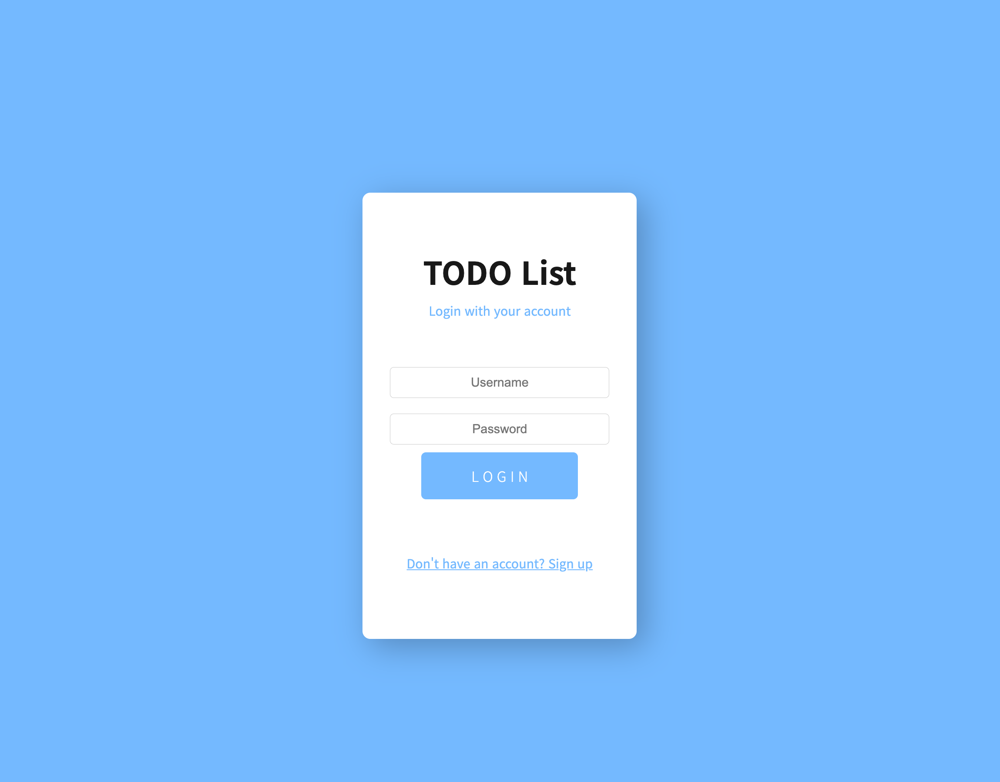
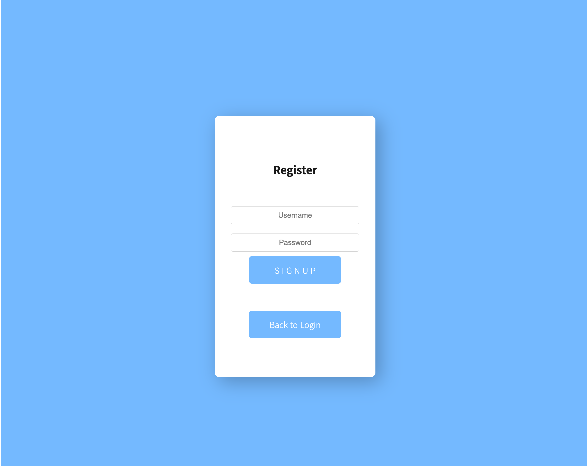
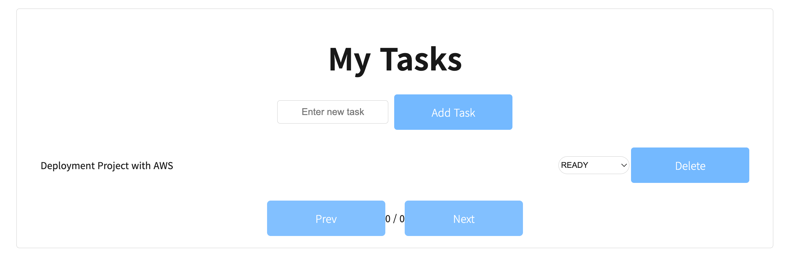

# Todo App

This is a simple todo app with spring boot and react.
<br/>
You can register and login to the app and see your todo list.
<br/>
You can just run this app following the instructions below.

# Start Client Project

## PreRequisites

- Install [NodeJS](https://nodejs.org/en/download/)

## Install

```bash
npm install --prefix client
```

## Run

```bash
npm run dev --prefix client
```

## Quick Start

```bash
cd client && chmod +x quickstart.sh && bash quickstart.sh
```

Just run this script to install and run the client project.

# Start Server Project

## PreRequisites

- Install [Docker](https://docs.docker.com/get-docker/)
- Install [Docker Compose](https://docs.docker.com/compose/install/)
- Install [Java 17](https://www.oracle.com/java/technologies/downloads/#java17)

## Docker Compose up

```bash
docker compose -f server/dev/docker-compose.yml up --build -d
```

## Install

```bash
chmod +x ./server/gradlew && ./server/gradlew build --project-dir server
```

## Run

```bash
java -Dspring.profiles.active=local -jar ./server/build/libs/server-0.0.1-SNAPSHOT.jar
```

## Quick Start

```bash
cd server && chmod +x quickstart.sh && bash quickstart.sh
```

Just run this script to install and run the server project.

# Enter to Site

http://localhost



You will see the login page.



You can register in this page.



You can see your todo list in this page.

# Deploy with AWS

This project is automatically deployed to AWS with github actions.

To do this, you need to enroll variables as secrets in github actions.

```bash
# common
AWS_ACCESS_KEY_ID=your aws access key id
AWS_SECRET_ACCESS_KEY=your aws secret access key
AWS_REGION=your aws region

# server
APPLICATION_PROD_YML=your base64 encoded application-prod.yml
AWS_S3_DEPLOY_MAIN_BUCKET_NAME=your s3 deploy bucket name
AWS_CODEDEPLOY_MAIN_APP_NAME=your codedeploy app name
AWS_CODEDEPLOY_MAIN_GROUP_NAME=your codedeploy group name

# client
AWS_S3_CLIENT_MAIN_BUCKET_NAME=your s3 client bucket name
AWS_CLOUDFRONT_MAIN_DISTRIBUTION_ID=your cloudfront distribution id
```

Enroll this variable to github actions secret.
<br/>

If you don't enroll this variable, CD workflow will be broken. if you want to run only locally, don't care about workflow failure.
